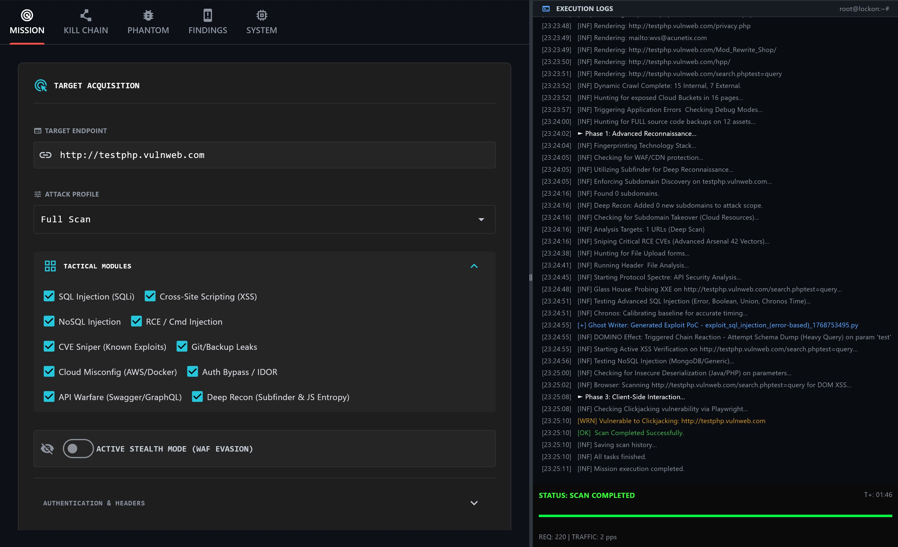
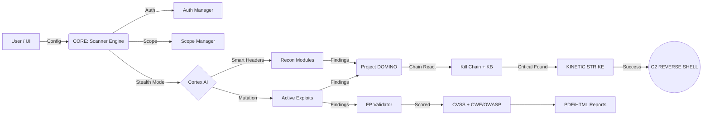

# LOCKON: THE ORBITAL STRIKE


**The Ultimate Advanced Web Application Security Scanner & Exploitation Framework.**

LOCKON: THE ORBITAL STRIKE is a next-generation security tool designed for Red Teamers and Bounty Hunters. It combines automated vulnerability scanning with "KINETIC STRIKE" active exploitation capabilities, targeting Web Apps, APIs, Cloud Infrastructure, and Corporate Networks.



---

##  Key Features

###  KINETIC STRIKE (Active Exploitation)
- **42+ RCE Arsenal**: Fully automated Remote Code Execution for major CVEs (Metabase, PaperCut, Solr, WebLogic, Struts, Log4Shell, etc.).
- **Infrastructure Killers**: Takeover Big Data systems (Hadoop YARN, RocketMQ, HugeGraph) and Monitor tools (Cacti, Zabbix).
- **Auto-Shell**: Automatically uploads Web Shells and establishes Reverse Shells (C2) upon successful exploit.

###  Advanced Scanning Engine
- **Deep Recon**: Subdomain enumeration (Subfinder), Tech Detection (Wappalyzer), WAF Detection, and JS Entropy Analysis.
- **Injection Engine**: SQLi, XSS (DOM/Reflected), NoSQL, LDAP, SSTI, XXE, CRLF, OS Command Injection, and Deserialization attacks.
- **API Warfare**: GraphQL Introspection, JWT Attack, Mass Assignment, WebSocket Hijacking, and API Fuzzing.
- **Nuclei Templates**: Built-in Nuclei template engine for security headers, default credentials, exposed panels, and more.

###  Active Stealth & Evasion
- **WAF Evasion**: Jitter/Delay randomization, Header rotation, and smart payload mutation.
- **Cortex AI**: Adaptive scanning patterns, context-aware analysis, and abort-safe sleep with stop event polling.
- **Scope Manager**: Wildcard include/exclude patterns to control scan boundaries.

###  Enterprise-Grade Analysis
- **CVSS 3.1 Scoring**: Every finding automatically scored with CVSS vector, severity, and CWE/OWASP mapping.
- **False Positive Validator**: Heuristic-based confidence scoring and optional re-validation.
- **Remediation Guides**: Detailed fix guides attached to every finding.
- **Ghost Writer**: Auto-generated standalone PoC scripts for confirmed High/Critical vulnerabilities.
- **PDF & HTML Reports**: Professional scan reports with executive summary and technical details.

###  Authentication Support
- **Cookie Authentication**: Session-based authenticated scanning.
- **Bearer Token**: JWT/API token injection into all modules.
- **Form Login**: Automatic form-based login with session cookie capture.

###  Visual Command Center
- **Orbital Attack Graph**: Visualize the Kill Chain from Recon to Action.
- **Loot Gallery**: Browse captured screenshots, secrets, and files directly in the UI.
- **Payload Editor**: Built-in payload crafting and mutation workspace.
- **Proxy Intercept**: Real-time HTTP request/response interception and modification.

---

##  System Architecture



---

##  Tech Stack & Components

| Component | Technology | Description |
| :--- | :--- | :--- |
| **Core Engine** |  | AsyncIO Event Loop, Multi-threading |
| **UI Framework** |  | Flutter-based Python GUI for Cross-platform |
| **Network** |  | High-performance Async HTTP Client |
| **Headless** |  | Chromium Engine for DOM XSS & Deep Scanning |
| **Parsing** |  | HTML/XML Parser & Scraper |
| **Crypto** |  | JWT Manipulation & Forgery |
| **Reporting** |  | Professional PDF Report Generation |
| **Templates** |  | YAML-based Vulnerability Templates |
| **Recon** |  | Subdomain Enumeration Engine |

---

##  Project Structure

```bash
LOCKON-ORBITAL-STRIKE/
├── core/               #  Neural Engine
│   ├── scanner.py      #  Main Scan Orchestrator
│   ├── cortex.py       #  AI Brain (Adaptive Evasion)
│   ├── domino.py       #  Chain Reaction Engine
│   ├── evasion.py      #  WAF Bypass & Header Rotation
│   ├── auth_manager.py #  Cookie/Bearer/Form Auth
│   ├── scope_manager.py#  Scan Boundary Control
│   ├── fp_validator.py #  False Positive Validator
│   ├── cvss_calculator.py # CVSS 3.1 Scoring
│   ├── remediation_db.py  # Fix Guides Database
│   ├── ghost_writer.py #  Auto PoC Generator
│   ├── nuclei_runner.py#  Nuclei Template Engine
│   ├── reporter.py     #  HTML Report Generator
│   ├── pdf_reporter.py #  PDF Report Generator
│   ├── proxy_engine.py #  HTTP Proxy Interceptor
│   ├── scheduler.py    #  Scan Scheduler
│   └── plugin_loader.py#  Plugin System
├── gui/                #  Orbital UI (Flet)
│   └── tabs/           #  Mission, Findings, Graph,
│                       #  History, Phantom, Payload
│                       #  Editor, Proxy, System
├── modules/            #  Attack Modules
│   ├── active/         #  44 Active Scanners
│   ├── exploit/        #  KINETIC STRIKE (Shells)
│   ├── recon/          #  Discovery (14 Modules)
│   ├── chain/          #  Kill Chain Engine
│   ├── post_exploit/   #  Post-Exploitation
│   └── payloads/       #  Venom Mutation Engine
├── templates/nuclei/   #  Nuclei YAML Templates
├── plugins/            #  Custom Plugin System
├── api/                #  REST API Server
├── pocs/               #  Auto-Generated PoCs
├── loot/               #  Exfiltrated Data
├── reports/            #  HTML/PDF Reports
└── main.py             #  Entry Point
```

---

##  Supported Vulnerabilities (Active Arsenal)

<details>
<summary><strong>View Full Target List (42+ Modules)</strong></summary>

| Category | Target System | CVE ID | Impact |
| :--- | :--- | :--- | :--- |
| **Enterprise** | Metabase BI | CVE-2023-38646 | **Pre-Auth RCE** |
| **Enterprise** | PaperCut MF/NG | CVE-2023-27350 | **Bypass & RCE** |
| **Enterprise** | SaltStack | CVE-2020-11651 | **Master Takeover** |
| **Enterprise** | VMware vCenter | CVE-2021-21972 | **Upload RCE** |
| **Enterprise** | Citrix ADC/Gateway | CVE-2019-19781 | **RCE** |
| **Enterprise** | Atlassian Confluence | CVE-2022-26134 | **OGNL Injection** |
| **Enterprise** | Atlassian Confluence | CVE-2023-22515 | **Privilege Escalation** |
| **Enterprise** | Jenkins CI/CD | CVE-2024-23897 | **CLI RCE** |
| **Enterprise** | JetBrains TeamCity | CVE-2023-42793 | **Auth Bypass** |
| **Enterprise** | ConnectWise ScreenConnect | CVE-2024-1709 | **Auth Bypass** |
| **Enterprise** | Fortinet FortiClient EMS | CVE-2023-48788 | **SQLi RCE** |
| **Enterprise** | Palo Alto GlobalProtect | CVE-2024-3400 | **Command Injection** |
| **Enterprise** | Ivanti Connect Secure | CVE-2024-21887 | **Command Injection** |
| **Network** | F5 BIG-IP | CVE-2022-1388 | **Auth Bypass** |
| **Network** | Cisco/Network Devices | - | **SNMP RCE** |
| **Big Data** | Apache HugeGraph | CVE-2024-27348 | **Gremlin RCE** |
| **Big Data** | Hadoop YARN | - | **Unauth RCE** |
| **Big Data** | Apache RocketMQ | CVE-2023-33246 | **Broker RCE** |
| **Big Data** | Apache ActiveMQ | CVE-2023-46604 | **Deserialization** |
| **Big Data** | Apache Superset | CVE-2023-27524 | **Default Secret** |
| **Big Data** | Ray Framework | CVE-2023-48022 | **ShadowRay RCE** |
| **Big Data** | MLflow | CVE-2023-1177 | **LFI / RCE** |
| **Cloud** | Kubernetes Kubelet | Port 10250 | **Unauth RCE** |
| **Cloud** | Kubernetes API | Port 6443 | **Unauth Access** |
| **Cloud** | Docker Daemon | Port 2375 | **Unauth RCE** |
| **Cloud** | ArgoCD | CVE-2023-25555 | **RCE** |
| **Cloud** | MinIO Storage | CVE-2023-28432 | **Info Disclosure** |
| **Web App** | Apache OFBiz | CVE-2024-38856 | **Pre-Auth RCE** |
| **Web App** | GeoServer | CVE-2024-36401 | **OGC RCE** |
| **Web App** | CrushFTP | CVE-2024-4040 | **Sandbox Escape** |
| **Web App** | Nexus Repository | CVE-2024-4956 | **Path Traversal** |
| **Web App** | Cacti Monitoring | CVE-2022-46169 | **Poller RCE** |
| **Web App** | GitLab (ExifTool) | CVE-2021-22205 | **RCE** |
| **Web App** | Redis | CVE-2022-0543 | **Lua Sandbox Escape** |
| **Legacy** | Apache Struts 2 | CVE-2017-5638 | **Remote Code Exec** |
| **Legacy** | WebLogic Server | CVE-2020-14882 | **Console RCE** |
| **Legacy** | Log4j (Log4Shell) | CVE-2021-44228 | **JNDI Injection** |
| **Legacy** | Shellshock | CVE-2014-6271 | **Bash RCE** |
| **Legacy** | Drupal (Drupalgeddon2) | CVE-2018-7600 | **RCE** |
| **Legacy** | ThinkPHP 5.x | - | **RCE** |
| **Legacy** | Spring Cloud Function | CVE-2022-22963 | **SpEL Injection** |
| **Legacy** | PHP-CGI | CVE-2024-4577 | **Arg Injection** |
| **IoT** | Hikvision IP Camera | CVE-2021-36260 | **Command Injection** |

</details>

<details>
<summary><strong>View General Vulnerability Modules (Core Engine — 44 Modules)</strong></summary>

| Category | Module Name | Capabilities |
| :--- | :--- | :--- |
| **Injection** | `xss.py, dom_xss.py` | Reflected, Stored, and DOM-based XSS scanning |
| **Injection** | `injection.py` | SQLi (Error/Blind), HTML Injection, Iframe Injection |
| **Injection** | `ssti.py` | Server-Side Template Injection (Jinja2, Mako, etc.) |
| **Injection** | `nosql_injection.py` | NoSQL Injection (MongoDB, etc.) |
| **Injection** | `ldap_injection.py` | LDAP Injection |
| **Injection** | `xxe_deep.py` | XML External Entity (XXE) Injection |
| **Injection** | `crlf_injector.py` | CRLF Injection / HTTP Response Splitting |
| **Injection** | `os_cmd.py` | OS Command Injection (Blind & Output-based) |
| **Injection** | `deserialization.py` | Java/PHP/Python Deserialization attacks |
| **Auth** | `auth_bypass.py` | 401/403 Bypass (Headers, Methods, URL encoding) |
| **Auth** | `auth_security.py` | Authentication security checks |
| **Auth** | `jwt_breaker.py` | JWT None Algo, Weak Secret, Kid Header Injection |
| **Auth** | `admin_brute.py` | Admin Panel Finder & Default Credential check |
| **Auth** | `privesc.py` | Privilege Escalation checks |
| **Access** | `idor.py` | IDOR (Insecure Direct Object Reference) detection |
| **Access** | `lfi.py` | Local File Inclusion (Path Traversal) |
| **Access** | `ssrf.py` | Server-Side Request Forgery |
| **Access** | `cors.py` | CORS Misconfiguration (Wildcard Origin) |
| **Access** | `redirect.py` | Open Redirect detection |
| **API** | `api_scanner.py` | API specific vulnerabilities (REST, SOAP) |
| **API** | `api_fuzzer.py` | API endpoint fuzzing & parameter discovery |
| **API** | `graphql.py` | GraphQL Introspection & Injection |
| **API** | `websocket_scanner.py` | CSWSH (Cross-Site WebSocket Hijacking) |
| **API** | `ws_fuzzer.py` | WebSocket protocol fuzzing |
| **Logic** | `race_condition.py` | Race Condition testing |
| **Logic** | `proto_pollution.py` | Prototype Pollution (Client/Server) |
| **Logic** | `smuggling_verify.py` | HTTP Request Smuggling (CL.TE, TE.CL) |
| **Logic** | `clickjacking.py` | X-Frame-Options Missing |
| **Logic** | `host_header.py` | Host Header Injection (Cache Poisoning) |
| **Logic** | `takeover.py` | Subdomain Takeover verification |
| **Recon** | `param_miner.py` | Hidden parameter discovery |
| **Recon** | `error_exposure.py` | Debug/Error page information disclosure |
| **Leak** | `secrets.py` | API Key & Secret Leaks in JS/HTML |
| **Leak** | `git_extractor.py` | Exposed `.git` repository |
| **Leak** | `bucket_looter.py` | Public S3/Cloud Buckets |
| **Leak** | `backup_killer.py` | Backup files (.bak, .old, .zip) exposure |
| **Client** | `client_fuzzer.py` | Client-side deep scanning & DOM analysis |
| **Client** | `evasion_evo.py` | Advanced WAF evasion techniques |
| **Shell** | `upload_rce.py` | Unrestricted File Upload to RCE |

</details>


---

##  Installation

1. **Clone the Repository**
   ```bash
   git clone https://github.com/Meow-011/LOCKON-ORBITAL-STRIKE.git
   cd LOCKON-ORBITAL-STRIKE
   ```

2. **Install Dependencies (Virtual Environment Recommended)**
   
   It is recommended to use a virtual environment to avoid conflicts.

   **Windows:**
   ```powershell
   python -m venv venv
   .\venv\Scripts\activate
   pip install -r requirements.txt
   ```

   **Linux / macOS:**
   ```bash
   python3 -m venv venv
   source venv/bin/activate
   pip install -r requirements.txt
   ```

3. **Install Playwright Browser**
   ```bash
   python -m playwright install chromium
   ```

4. **Verify Setup**
   - Run the tool and check the **SYSTEM** tab to verify external tools (Nuclei, Subfinder, Playwright) and Python libraries.

---

##  Usage

Run the main application:
```bash
python main.py
```

1. Enter the **Target URL** in the Mission Tab.
2. Select your **Attack Profile** (Full Scan, SQLi Only, etc.).
3. Configure **Tactical Modules** (Custom module selection).
4. Set **Authentication** (Cookie, Bearer Token, or Form Login) if needed.
5. Toggle **Active Stealth Mode** if WAF evasion is needed.
6. Click **INITIALIZE ATTACK VECTOR**.

---

##  Troubleshooting

### 1.  Playwright / Browser Issues
If you see errors related to "Browser not installed":
```bash
python -m playwright install chromium
```

### 2.  "Module Not Found" Error
Ensure you are running in the correct environment or try reinstalling requirements:
```bash
pip install --upgrade --force-reinstall -r requirements.txt
```

### 3.  Antivirus / Windows Defender Alert
Since **LOCKON** contains real exploit payloads (Reverse Shells, Web Shells), your AV might flag it as malicious.
- **Solution**: Add the project folder to your Antivirus **Exclusions** list.
- *Note: This behavior is normal for security tools.*

### 4.  Database Locked / Disk Full
If scan history fails to save:
- Delete `lockon_history.db` to reset the database.
- Ensure sufficient disk space for reports and PoCs.

---

##  Disclaimer

**This tool is for EDUCATIONAL PURPOSES and AUTHORIZED PENETRATION TESTING ONLY.**
Do not use this tool on systems you do not own or do not have explicit permission to test. The authors are not responsible for any misuse or damage caused by this tool.
