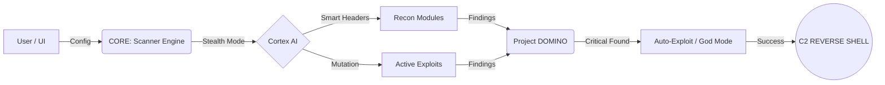

# LOCKON: THE ORBITAL STRIKE

  

**The Ultimate Advanced Web Application Security Scanner & Exploitation Framework.**

LOCKON is a next-generation security tool designed for Red Teamers and Bounty Hunters. It combines automated vulnerability scanning with "God Mode" active exploitation capabilities, targeting Web Apps, APIs, Cloud Infrastructure, and Corporate Networks.

---

##  Key Features

###  GOD MODE (Active Exploitation)
- **42+ RCE Arsenal**: Fully automated Remote Code Execution for major CVEs (Metabase, PaperCut, Solr, WebLogic, Struts, Log4Shell, etc.).
- **Infrastructure Killers**: Takeover Big Data systems (Hadoop YARN, RocketMQ, HugeGraph) and Monitor tools (Cacti, Zabbix).
- **Auto-Shell**: Automatically uploads Web Shells and establishes Reverse Shells (C2) upon successful exploit.

###  Advanced Scanning
- **Deep Recon**: Subdomain enumeration (Subfinder), Tech Detection (Wappalyzer), and WAF Detection.
- **Injection Engine**: SQLi, XSS (DOM/Reflected), NoSQL, LDAP, SSTI, and Command Injection.
- **API Warfare**: GraphQL Introspection, JWT Attack, and Mass Assignment scanning.

###  Active Stealth
- **WAF Evasion**: Jitter/Delay randomization and Header rotation.
- **Cortex AI**: Adaptive scanning patterns to avoid detection.

###  Visual Command Center
- **Orbital Attack Graph**: Visualize the Kill Chain from Recon to Action.
- **Loot Gallery**: Browse captured screenshots, secrets, and files directly in the UI.

---

##  System Architecture



---

##  Supported Vulnerabilities (Active Arsenal)

| Category | Target System | CVE ID | Impact |
| :--- | :--- | :--- | :--- |
| **Enterprise** | Metabase BI | CVE-2023-38646 | **Pre-Auth RCE** |
| **Enterprise** | PaperCut MF/NG | CVE-2023-27350 | **Bypass & RCE** |
| **Enterprise** | SaltStack | CVE-2020-11651 | **Master Takeover** |
| **Enterprise** | VMware vCenter | CVE-2021-21972 | **Upload RCE** |
| **Enterprise** | Citrix ADC/Gateway | CVE-2019-19781 | **RCE** |
| **Enterprise** | Atlassian Confluence | CVE-2022-26134 | **OGNL Injection** |
| **Enterprise** | Atlassian Confluence | CVE-2023-22515 | **Privilege Escalation** |
| **Enterprise** | Jenkins CI/CD | CVE-2024-23897 | **CLI RCE** |
| **Enterprise** | JetBrains TeamCity | CVE-2023-42793 | **Auth Bypass** |
| **Enterprise** | ConnectWise ScreenConnect | CVE-2024-1709 | **Auth Bypass** |
| **Enterprise** | Fortinet FortiClient EMS | CVE-2023-48788 | **SQLi RCE** |
| **Enterprise** | Palo Alto GlobalProtect | CVE-2024-3400 | **Command Injection** |
| **Enterprise** | Ivanti Connect Secure | CVE-2024-21887 | **Command Injection** |
| **Network** | F5 BIG-IP | CVE-2022-1388 | **Auth Bypass** |
| **Network** | Cisco/Network Devices | - | **SNMP RCE** |
| **Big Data** | Apache HugeGraph | CVE-2024-27348 | **Gremlin RCE** |
| **Big Data** | Hadoop YARN | - | **Unauth RCE** |
| **Big Data** | Apache RocketMQ | CVE-2023-33246 | **Broker RCE** |
| **Big Data** | Apache ActiveMQ | CVE-2023-46604 | **Deserialization** |
| **Big Data** | Apache Superset | CVE-2023-27524 | **Default Secret** |
| **Big Data** | Ray Framework | CVE-2023-48022 | **ShadowRay RCE** |
| **Big Data** | MLflow | CVE-2023-1177 | **LFI / RCE** |
| **Cloud** | Kubernetes Kubelet | Port 10250 | **Unauth RCE** |
| **Cloud** | Kubernetes API | Port 6443 | **Unauth Access** |
| **Cloud** | Docker Daemon | Port 2375 | **Unauth RCE** |
| **Cloud** | ArgoCD | CVE-2023-25555 | **RCE** |
| **Cloud** | MinIO Storage | CVE-2023-28432 | **Info Disclosure** |
| **Web App** | Apache OFBiz | CVE-2024-38856 | **Pre-Auth RCE** |
| **Web App** | GeoServer | CVE-2024-36401 | **OGC RCE** |
| **Web App** | CrushFTP | CVE-2024-4040 | **Sandbox Escape** |
| **Web App** | Nexus Repository | CVE-2024-4956 | **Path Traversal** |
| **Web App** | Cacti Monitoring | CVE-2022-46169 | **Poller RCE** |
| **Web App** | GitLab (ExifTool) | CVE-2021-22205 | **RCE** |
| **Web App** | Redis | CVE-2022-0543 | **Lua Sandbox Escape** |
| **Legacy** | Apache Struts 2 | CVE-2017-5638 | **Remote Code Exec** |
| **Legacy** | WebLogic Server | CVE-2020-14882 | **Console RCE** |
| **Legacy** | Log4j (Log4Shell) | CVE-2021-44228 | **JNDI Injection** |
| **Legacy** | Shellshock | CVE-2014-6271 | **Bash RCE** |
| **Legacy** | Drupal (Drupalgeddon2) | CVE-2018-7600 | **RCE** |
| **Legacy** | ThinkPHP 5.x | - | **RCE** |
| **Legacy** | Spring Cloud Function | CVE-2022-22963 | **SpEL Injection** |
| **Legacy** | PHP-CGI | CVE-2024-4577 | **Arg Injection** |
| **IoT** | Hikvision IP Camera | CVE-2021-36260 | **Command Injection** |


---

##  Installation

1. **Clone the Repository**
   ```bash
   git clone https://github.com/Meow-011/LOCKON-ORBITAL-STRIKE.git
   cd LOCKON-ORBITAL-STRIKE
   ```

2. **Install Dependencies**
   ```bash
   pip install -r requirements.txt
   ```

3. **Verify Setup**
   - Run the tool and check the "SYSTEM" tab to verify external tools (Nuclei, Subfinder, Playwright) and Python libraries.

---

##  Usage

Run the main application:
```bash
python main.py
```

1. Enter the **Target URL** in the Mission Tab.
2. Select your **Attack Profile** (Full Scan, SQLi Only, etc.).
3. Toggle **Active Stealth Mode** if WAF evasion is needed.
4. Click **INITIALIZE ATTACK VECTOR**.

---

##  Disclaimer

**This tool is for EDUCATIONAL PURPOSES and AUTHORIZED PENETRATION TESTING ONLY.**
Do not use this tool on systems you do not own or do not have explicit permission to test. The authors are not responsible for any misuse or damage caused by this tool.

---

*Powered by LOCKON Security Research Team.*